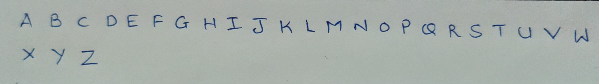
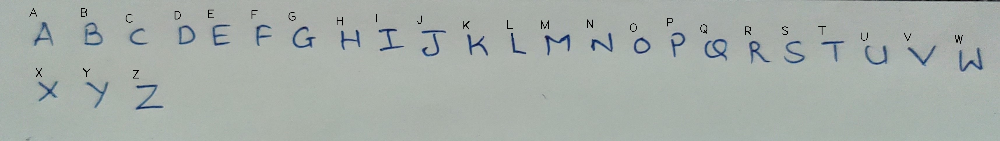

# ICR (Intelligent Character Recognition)
>**NOTE:** This is a very granular level implementation of the ICR for Uppercase Alphabets, thus it can be used to be implemented in projects with ease. <br/>

### Input:


### Output:


|`Library`|`Installaion`|
|---|---|
|opencv| `pip install opencv-python`|
|tensorflow|`pip install tensorflow`|
|numpy|`pip install numpy`|

To run the model on your image data, just provide the path of the file in the `ICR.py` file and change the following line 
```python
img = cv2.imread('path/to/your/file.extension')
```
and then run the following code in the cmd or terminal `python ICR.py` you can see your result in the main directory of 
the project with name `contoured1.jpg` it can also be renamed in the same file by going to the line
```python
cv2.imwrite('filename.extension', img)
```
---
If you wish to use the __pretrained weights__ they are saved by name **weights.h5**, just load them using the `load_model`
function from `tf.keras.models`
```python
# Example
model = load_model('weights.h5')
```
---
If you wish to train the same neural network on your own dataset, make the following changes in the following lines in 
either __`neural_model.py`__.

> On line 10
```python
CATEGORIES = ['Categories', 'That', 'Task', 'Needs']
```

> On line 11
```python
DATADIR = 'Path/to/your/dataset'
```
> On line 55
```python
model.add(Dense('No. of categories you added in categories list'))
```
> On line 68
```python
image = cv2.imread('path/to/your/test/data', 0)
```
And then simply run the run the model by `python neural_model.py`

### Note:
```
The file structure for training data should be
Dataset
   |- Category 1
          |- Data for category 1
   |- Category 2
          |- Data for category 1
   :
   :
   :
   |- Category n
          |- Data for category n
```
> If not please make the necessary changes in the script to load the data as per your need
